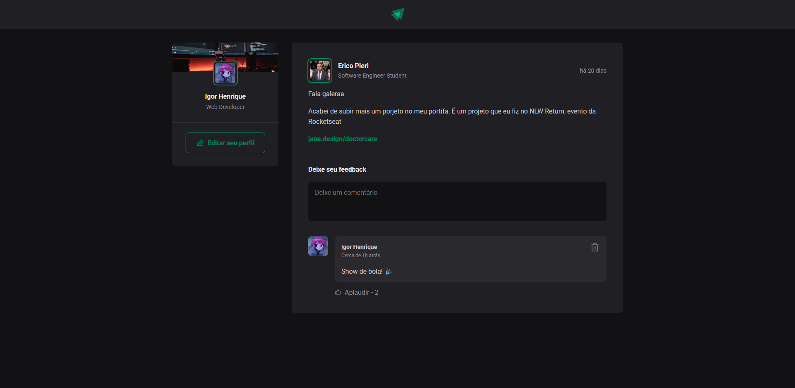

# 🚀 Ignite Feed

Projeto desenvolvido durante a formação React da Rocketseat. O Ignite Feed é uma aplicação simples de feed de posts, onde os usuários podem interagir com o conteúdo deixando comentários, curtindo as publicações e visualizando as informações dos posts de forma dinâmica.

## 🛠️ Tecnologias

- React
- TypeScript
- CSS Modules
- date-fns (para formatação de datas)
- Phosphor Icons (para ícones)

## 🏃‍♂️ Como Rodar o Projeto

Clone o projeto

```bash
git clone https://github.com/igorhnq/ignite-rocketseat
```

Entre no diretório do projeto

```bash
cd ignite-rocketseat
```

Instale as dependências

```bash
npm install
```

Inicie o servidor

```bash
npm run dev
```

## 📸 Imagens do Projeto


